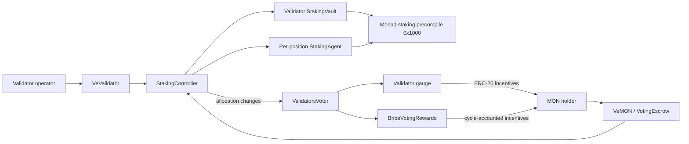

# Quevra Contracts

Foundry package for Quevra's validator staking, voting, gauge, and reward contracts on Monad. The contracts coordinate native MON staking through Monad's staking precompile at `0x1000` and use Monad staking epochs as the protocol clock.

## Architecture



### Modules

| Area | Contracts | Responsibility |
| --- | --- | --- |
| Escrow | `VeMON`, `VeValidator`, `VotingEscrow` | `VeMON` locks native MON and represents positions as veNFTs with epoch-based voting-power checkpoints. `VeValidator` creates permanent, non-transferable validator identity positions. `VotingEscrow` contains shared checkpoint and lock accounting. |
| Staking administration | `StakingAdmin`, `StakingController` | Deploys deterministic vaults, validates validator submissions, stores commission settings, tracks staking intent, and coordinates native staking operations. |
| Staking custody | `StakingVault`, `StakingAgent`, `StakeControlled` | `StakingVault` is bound to one validator and accounts for position balances and native validator rewards. A `StakingAgent` executes delegation, undelegation, matured withdrawals, and reward operations for a veMON position. `StakeControlled` wraps the Monad staking precompile interface. |
| Voting and gauges | `ValidatorsVoter`, `NonStakingVoter`, `Gauge`, `NonStakingGauge` | Connects validator gauges to staking allocations, manages gauge weights and reward funding, and accounts for ERC-20 gauge rewards. A non-staking gauge assigns its reward balance to a beneficiary. |
| Cycle rewards | `Reward`, `VotingReward`, `BribeVotingRewards` | Checkpoints position balances and supply by cycle, records reward funding, and pays eligible veMON positions. Bribes are distinct from native MON rewards earned from validator staking. |
| Interfaces and libraries | `src/interfaces/`, `src/libraries/` | Defines protocol-facing APIs and shared epoch, boost, payload, cast, and staking-reward accounting helpers. |

### Staking and validator lifecycle

1. The operator creates a validator position through `VeValidator`. For a new validator, the submission includes a 165-byte Monad `addValidator` payload plus its secp256k1 and BLS signatures. The controller checks the predicted vault/auth address against the payload. Existing validators use `createExistingValidator` and are checked against the staking precompile.
2. `StakingController` deploys a deterministic `StakingVault` and binds it to the validator position. The vault is the authorized caller for validator registration and staking operations routed through the Monad precompile.
3. The new-validator vault accumulates the fixed `VALIDATOR_STAKE_AMOUNT` before it submits `addValidator`. The amount, commission scale, and signing configuration are exposed by the controller for payload construction.
4. A MON holder creates a veMON lock. The escrow deposits the MON into the controller and records the principal and its voting-power checkpoints.
5. The holder supplies a desired allocation across validator vaults. The controller records that intent and settles it through vaults and agents. Monad undelegations have a withdrawal delay; permissionless calls to `poke` can complete pending transitions once funds become available.
6. Native staking rewards can be claimed or compounded through the controller. Gauge incentives and bribes are accounted for by their own reward contracts and cycle checkpoints.

The current `ProtocolTimeLibrary` defines a Quevra cycle as five Monad staking epochs. Cycle length is a protocol configuration and should be reviewed before deployment to a production network.

## Source layout

```text
src/
  VeMON.sol, VeValidator.sol, VotingEscrow.sol
  staking/                 Controller, admin, vault, and agent modules
  voting/                  Validator and non-staking voters
  gauges/                  Staking and non-staking reward gauges
  rewards/                 Cycle rewards and bribe accounting
  interfaces/              Protocol contract APIs
  libraries/               Shared accounting and Monad helpers
test/
  *.t.sol                  Unit and module-level tests
  integration/             Cross-module staking scenarios
  fixtures/                Shared test setup
script/e2e/                Local Solonet validator-registration flow
```

## Requirements and setup

- Foundry (`forge` and `anvil`)
- Git with submodule support
- Docker for the Solonet end-to-end test

This package is a Git submodule in the Quevra workspace. From the workspace root, initialize submodules and install JavaScript workspace dependencies with pnpm:

```sh
git submodule update --init --recursive
pnpm install
```

Or clone the parent repository with `--recurse-submodules`. The contract sources and Foundry configuration are in this directory. Build and test from the package directory:

```sh
cd packages/contracts
forge build
forge test
forge fmt
```

Or run the package scripts from the workspace root:

```sh
pnpm --filter @quevra/contracts build
pnpm --filter @quevra/contracts test
pnpm --filter @quevra/contracts check
```

The default Foundry configuration targets Monad testnet, chain ID `10143`, and pins a fork block. Tests using Monad's staking environment require access to the configured Monad RPC endpoint. To run the full package check, run `pnpm --filter @quevra/contracts check`; it checks formatting, builds with size reporting, and runs the Foundry tests.

## Local Solonet end-to-end test

The E2E script deploys the validator-registration flow against a running Solonet, obtains fresh consensus keys in the Solonet container, submits the `addValidator` request, and checks the staking precompile. In the Quevra workspace, start the `services/solonet` submodule using its README; see the [Solonet repository](https://github.com/monad-crypto/monad-solonet) for standalone setup. Then run from the workspace root:

```sh
pnpm --filter @quevra/contracts test:e2e
```

Defaults are RPC `http://localhost:8080`, chain ID `20143`, and Docker container name `solonet`. The script accepts `SOLONET_RPC`, `SOLONET_CONTAINER`, `SOLONET_CHAIN_ID`, and related environment overrides. It uses development-only keys by default; never use them on a public network.

On Apple Silicon, the Solonet README documents the Colima/QEMU setup used by this E2E flow.

## Using the contracts

There is no complete deployment script or production deployment manifest in this package yet. A deployment must create the contracts in dependency order, configure their one-time controller/escrow/voter bindings, whitelist reward tokens, and record the resulting addresses. The exact deployment sequence depends on the selected reward token and the controller, veMON, veValidator, and voter addresses.

At a high level, a deployment and user flow includes:

1. Deploy controller, voting, escrow, and reward components with the intended owner and reward-token configuration.
2. Bind the controller to the veMON and validator escrow contracts, then bind the validator voter and boostable escrow as required by the contracts' one-time setters.
3. For a new validator, call the signing configuration view to determine the predicted vault auth address, then construct and sign the complete Monad validator payload using that address, the configured commission, and the fixed registration stake amount.
4. Create a validator position with the payload and signatures, then fund the position through veMON locks and controller allocations.
5. Use controller claim/compound operations for native staking rewards. Use gauge and bribe reward entrypoints for their separate ERC-20 incentives.

Consult the interfaces in `src/interfaces/` and tests in `test/` for function signatures and expected state transitions. Do not treat this overview as a substitute for checking deployment parameters and contract invariants.

## Tests

The test suite includes coverage for protocol time, veMON and validator positions, staking vaults and agents, controller allocations and rewards, and selected integration flows. The fork-native-reward test exercises interactions with a validator present in the configured Monad fork. Gauge, voter, and bribe behavior should be checked against their individual tests as that coverage is expanded.

Useful targeted commands:

```sh
forge test --match-path 'test/VeMON.t.sol'
forge test --match-path 'test/StakingController.t.sol'
forge test --match-path 'test/integration/*'
```

## Roadmap

The following items are planned and are not complete features of this package yet:

1. Add deployment scripts and network-specific configuration for Monad testnet, then publish verified contract addresses and transaction links.
2. Expand focused tests for validator gauge creation, voting-weight changes, cycle bribes, and reward claims, including access control, invalid inputs, accounting, and success cases.
3. Add deployment and upgrade safety documentation, including the required order for one-time address bindings and operational ownership.
4. Revisit the five-epoch cycle length and other economic parameters with production network conditions in mind.
5. Complete a source-license and attribution review for adapted code before making a package-wide license claim.

## Attribution and licensing

Check the SPDX identifier and provenance comments in each Solidity source file, and preserve upstream copyright and author notices when redistributing adapted code. This package currently contains files with different SPDX identifiers, including MIT and BUSL-1.1. A source file's header applies to that file; this README does not claim that the package as a whole has one license. Confirm that the selected licenses and permissions meet the intended distribution requirements before publishing or combining the package with other work.

## AI disclosure

AI coding tools were used during development, including assistance with contract documentation and this README.
